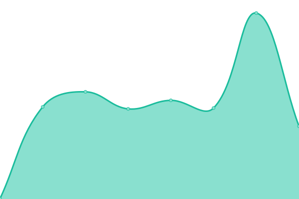
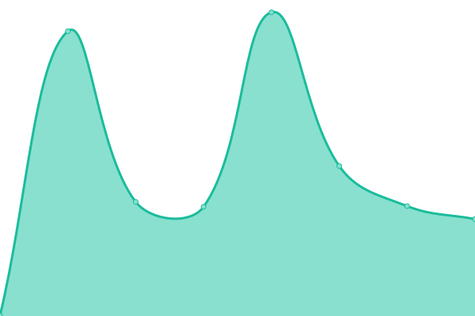
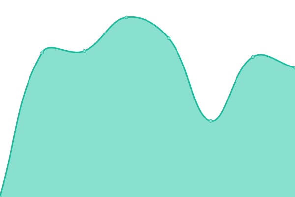

# [📈 Live Status](https://uptime.gebu8f.eu.org): <!--live status--> **🟩 All systems operational**

This repository contains the open-source uptime monitor and status page for [Upptime](https://upptime.js.org), powered by [Upptime](https://github.com/upptime/upptime).

With [Upptime](https://upptime.js.org), you can get your own unlimited and free uptime monitor and status page, powered entirely by a GitHub repository. We use [Issues](https://github.com/upptime/upptime/issues) as incident reports, [Actions](https://github.com/gebu8f/UptimeBOT/actions) as uptime monitors, and [Pages](https://UptimeBOT.gebu8f.eu.org) for the status page.

<!--start: status pages-->
<!-- This summary is generated by Upptime (https://github.com/upptime/upptime) -->
<!-- Do not edit this manually, your changes will be overwritten -->
<!-- prettier-ignore -->
| URL | Status | History | Response Time | Uptime |
| --- | ------ | ------- | ------------- | ------ |
|  [Passwd](https://passwd.gebu8f.pp.ua) | 🟩 Up | [passwd.yml](https://github.com/gebu8f/UptimeBOT/commits/HEAD/history/passwd.yml) | 

 712ms
     
 | 

<a href="https://uptime.gebu8f.eu.org/history/passwd">100.00%</a>
    

|  [Alist](https://alist.gebu8f.pp.ua) | 🟩 Up | [alist.yml](https://github.com/gebu8f/UptimeBOT/commits/HEAD/history/alist.yml) | 

 764ms
     
 | 

<a href="https://uptime.gebu8f.eu.org/history/alist">100.00%</a>
    

|  [Password1](https://pass-4a4m.onrender.com) | 🟩 Up | [password1.yml](https://github.com/gebu8f/UptimeBOT/commits/HEAD/history/password1.yml) | 

 418ms
     
 | 

<a href="https://uptime.gebu8f.eu.org/history/password1">100.00%</a>
    

|  [Alust1](https://gebu8f-0hnr.onrender.com) | 🟩 Up | [alust1.yml](https://github.com/gebu8f/UptimeBOT/commits/HEAD/history/alust1.yml) | 

 505ms
     
 | 

<a href="https://uptime.gebu8f.eu.org/history/alust1">100.00%</a>
    

|  [memos](https://note.gebu8f.pp.ua) | 🟩 Up | [memos.yml](https://github.com/gebu8f/UptimeBOT/commits/HEAD/history/memos.yml) | 

 670ms
     
 | 

<a href="https://uptime.gebu8f.eu.org/history/memos">100.00%</a>
    

|  [memos1](https://memos-941c.onrender.com) | 🟩 Up | [memos1.yml](https://github.com/gebu8f/UptimeBOT/commits/HEAD/history/memos1.yml) | 

 587ms
     
 | 

<a href="https://uptime.gebu8f.eu.org/history/memos1">100.00%</a>
    

<!--end: status pages-->

[**Visit our status website →**](https://uptime.gebu8f.eu.org)

## 📄 License

- Powered by: [Upptime](https://github.com/upptime/upptime)
- Code: [MIT](./LICENSE) © [Anand Chowdhary](https://anandchowdhary.com), supported by [Pabio](https://pabio.com)
- Data in the `./history` directory: [Open Database License](https://opendatacommons.org/licenses/odbl/1-0/)
